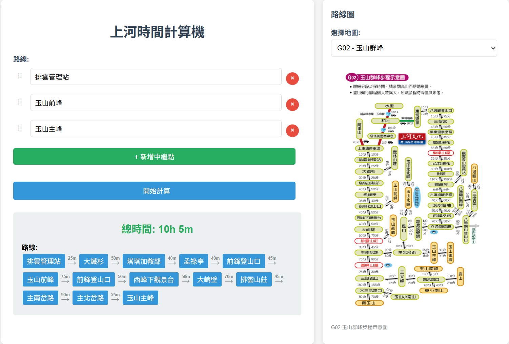

# Mountain Climbing Route Calculator

A Flask-based web application that calculates optimal climbing routes and times between mountain locations using Dijkstra's shortest path algorithm. Designed specifically for Taiwan mountain climbing routes.



## Features

- **Route Optimization**: Find the shortest path between mountain locations
- **Interactive Web Interface**: Clean, responsive web UI for route planning
- **Dynamic Graph Loading**: Switch between different mountain route datasets
- **Real-time Calculations**: Fast pathfinding using Dijkstra's algorithm

## Quick Start

### Prerequisites

- Python 3.x
- Flask

### Installation

1. Clone the repository:
```bash
git clone <repository-url>
cd climbcalc
```

2. Install dependencies:
```bash
pip install -r requirements.txt
```

3. Run the application:
```bash
python app.py
```

4. Open your browser and navigate to `http://127.0.0.1:5000`

## Usage

1. Select your starting location from the dropdown
2. Choose your destination location
3. Click "Calculate Route" to find the optimal path
4. View the shortest route and total travel time

## API Endpoints

- `GET /api/locations` - Get all available mountain locations
- `POST /api/calculate` - Calculate shortest path between two locations
- `GET /api/load_graph/<graph_name>` - Load a specific graph dataset

## Data Format

Graph files are stored in the `graphs/` directory with the format:
```
location1 location2 time_forward time_backward
```

- Times are in minutes
- Location names support Unicode characters
- Bidirectional paths are created automatically

## Testing

Run the test suite (ensure the Flask app is running on port 5000):
```bash
python test_app.py
```

## Project Structure

```
climbcalc/
├── app.py              # Main Flask application
├── templates/
│   └── index.html      # Web interface
├── graphs/
│   └── *.txt          # Mountain route data files
├── test_app.py        # Test suite
└── requirements.txt   # Python dependencies
```

## Contributing

1. Fork the repository
2. Create a feature branch
3. Make your changes
4. Run tests to ensure everything works
5. Submit a pull request